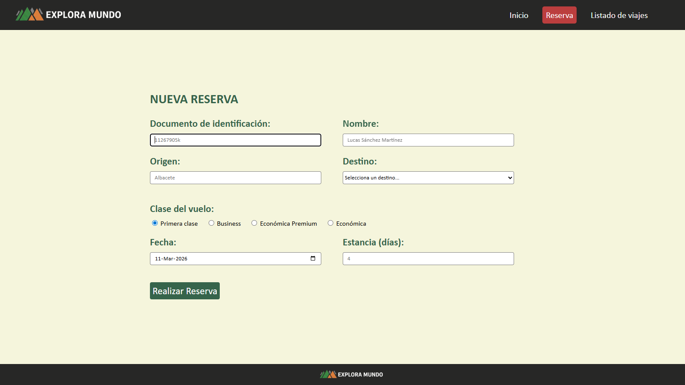
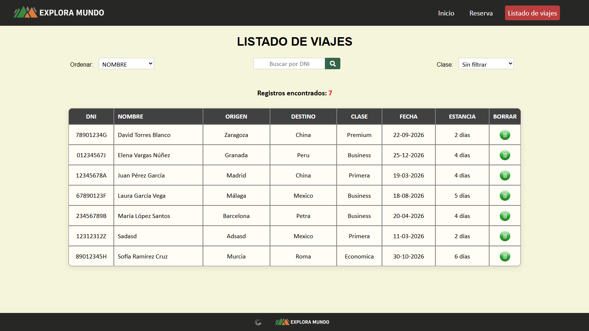
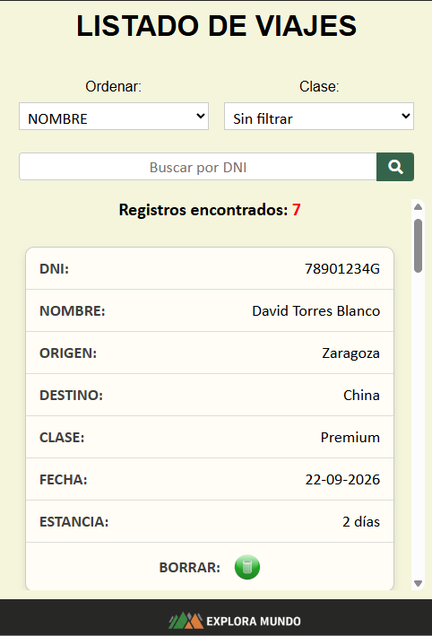

# Explora Mundo - Travel Booking CRUD

A CRUD I built as a class project. It is a web application that works synchronously (which is not the correct way to build this type of application) and allows users to create travel bookings as well as view a full list of all bookings made. This list includes a sorting filter, a filter to show only travellers of a specific flight class, and a search by ID number to find a specific traveller. On top of all this, there is a button to delete bookings.

> 🇪🇸 [Leer este README en Español](README.es.md)

---

## 🚀 Demo
🔗 [Explora Mundo](https://juanvalentin.alwaysdata.net/05/)

---

## 📸 Screenshots

| 1. Home page | 2. Booking form | 3. Listing |
| :---: | :---: | :---: |
|  |  | 

<div align="center">
<p><b>Mobile experience</b></p>
   
  </div>

---

## 🛠️ Technologies Used

| Layer | Technology |
|-------|-----------|
| Frontend | HTML5, CSS3 |
| Backend | PHP 8 |
| Database | MySQL (via AlwaysData) |
| Hosting | [AlwaysData](https://www.alwaysdata.com) |

---

## ⚠️ Architecture Note: Synchronous vs Asynchronous
**Technical reflection:** This application is currently built to work synchronously. Although iframes are used so that only part of the page reloads rather than the whole thing, I am aware that this is not the right approach for this type of application. It was built this way because it is a class project and at the time I did not yet have the knowledge to do it differently, but the correct approach would be to use asynchronous technology.
The difference is that with synchronous code (mine), when the server is carrying out a task the web page freezes completely until that task is finished, whereas with asynchronous code the page can keep working while the server processes the task in the background.

---

## 🧠 What I learned

- Connecting PHP to a **database**
- Building **dynamic SQL queries** with filters
- Structuring a multi-page PHP project
- Deploying a PHP + MySQL application to a **remote hosting provider**
- How to delete a registro from the list **without reloading the page**

---

## 📂 Project Structure

```bash
CRUD/
│
├── alta/                        # Registration module
│   ├── ficheros/                # Section resources
│   ├── imagenes/                # Images
│   ├── alta.html                # Booking form (frontend)
│   └── PHP_Alta_Usuario.php     # Handles INSERT into the DB
│
├── listado/                     # Listing module
│   ├── ficheros/                # Section resources
│   ├── imagenes/                # Images
│   ├── listado.php              # Travel listing page
│   └── PHP-Baja_Usuario.php     # Delete from the listing view
│
├── ficheros/                    # Main page resources
├── imagenes/                    # Main page images
├── screenshots/                 # Screenshots used in README.md
│
├── .gitignore
├── basedatos_01.sql             # SQL schema and initial data
└── index.html                   # Entry point / Home page
```

---

## 🛠️ Local Setup

1. Clone the repository: `git clone https://github.com/jvmarcos-dev/travel-agency-crud.git`
2. Set up a local server (XAMPP, WAMP or Docker).
3. Import `basedatos_01.sql` into your PHPMyAdmin.
4. Rename `ficheros/conexion.example.php` to `conexion.php` and set your credentials.
5. Open `localhost` in your browser.

---

## 👤 Author

**Juan Valentín Marcos Argandoña**

- LinkedIn: [Juan Valentín Marcos Argandoña](https://www.linkedin.com/in/juan-valent%C3%ADn-marcos-argando%C3%B1a-2864663b3/)
- GitHub: [@jvmarcos-dev](https://github.com/jvmarcos-dev)

---